# <div align="center">⚡ **DAM DINH HIEP** ⚡</div>

<div align="center">
  
</div>

<div align="center">
  
</div>

<div align="center">
  
[](https://visitcount.itsvg.in)


</div>

---

##  **EXECUTIVE PROFILE**


```javascript
class EliteDeveloper {
  constructor() {
    this.name = "Dang Quoc Huy";
    this.title = "Junior Fullstack Developer";
    this.location = "Vietnam 🇻🇳";
    this.experience = "2+ years";
    this.specialization = [
      "Enterprise Architecture",
      "Microservices Design",
      "AI/ML Integration",
      "DevOps Excellence"
    ];
  }

  getCurrentStatus() {
    return {
      focus: "Building next-gen AI-powered platforms",
      learning: ["Kubernetes", "Terraform", "GraphQL"],
      working_on: "Scalable microservices ecosystem",
      philosophy: "Code is poetry, architecture is art"
    };
  }

  getAchievements() {
    return [
      "💼 Led 15+ enterprise projects",
      "🏆 99.9% uptime across production systems",
      "⚡ Optimized performance by 300%+",
      "🎯 Reduced deployment time by 85%"
    ];
  }
}
```

<div align="center">

### 🎯 **MISSION STATEMENT**
*"Transforming complex business challenges into elegant, scalable solutions through cutting-edge technology and architectural excellence"*

</div>

---

##  **PERFORMANCE METRICS**

<div align="center">


- [ ] Scale engineering teams to 50+
- [ ] Achieve 99.99% system reliability
- [x] Implement DevOps excellence ✅
- [ ] Establish center of excellence

</td>
<td align="center" width="33%">

**🎯 IMPACT**
- [ ] $10M+ cost optimization
- [ ] 500% performance improvements
- [x] Zero-downtime deployments ✅
- [ ] Industry recognition awards

</td>
</tr>
</table>

### ⚡ **CURRENT FOCUS AREAS**

```mermaid
graph LR
    A[🤖 AI/ML Integration] --> B[☁️ Cloud Architecture]
    B --> C[🔧 DevOps Excellence]
    C --> D[📊 Data Engineering]
    D --> E[🔒 Security First]
    E --> A
```



</div>

---

<div align="center">
  
</div>

<div align="center">

### 💭 **PHILOSOPHY**
*"In a world of infinite possibilities, architecture is the art of making the impossible, inevitable."*

---

### 🔥 **ELITE STATUS**


**⭐ Starred by 1000+ developers** | **🤝 Building the future, one commit at a time**

---

<sub>💎 *Crafted with precision and passion* • *Last updated: August 2025* 💎</sub>

</div>


